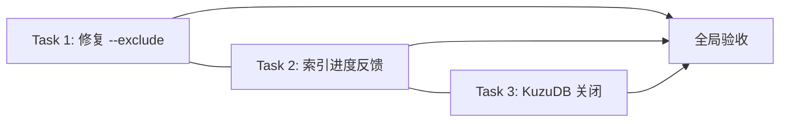

# CGC Bug 修复批次 1 实施计划

> **Execution mode:** executing-plans (sequential, main-agent controlled)

**Goal:** 修复 CGC 0.4.16 中三个已知软件 bug：`--exclude` 死代码过滤失效、索引后进度反馈缺失、KuzuDB 关闭未释放资源
**Architecture:** 修改 3 个文件（code_finder.py / pipeline.py / database_kuzu.py），每处改动量 ≤5 行，无架构变动
**Tech Stack:** Python 3.10+, KuzuDB, Cypher

---

## 一、目标

修复 CGC 0.4.16 中已验证的三个软件 bug，使：
1. `cgc analyze dead-code --exclude router` 正确过滤 `@router.get/post` 装饰的函数
2. 索引完成后进度条不卡在 100%，后处理阶段有明确反馈
3. 正常退出时 KuzuDB 数据库实例被释放，不残留锁文件

**不涉及**: `# cgc: skip-file` 功能（另行评估）、`cgc analyze deps` 语法提示（用户使用问题）、`<module>` 伪条目（行为特征）

---

## 二、当前状态

### 已验证基线

| 验证项 | 结论 | 证据 |
|:-------|:----:|:-----|
| `--exclude router` 不生效 | ❌ bug | Cypher 使用 `ALL(decorator_name IN $x WHERE NOT decorator_name IN func.decorators)` — 精确匹配，用户传 `router` 永远不匹配 `@router.get("/path")` |
| 索引 100% 后进度条不动 | ❌ bug | 后处理阶段无 job 更新，`while not indexing_task.done()` 循环继续但进度显示已完成 |
| `close_driver()` 未释放数据库 | ❌ bug | 只清连接池 + `self._db = None`，没有显式关闭 kuzu.Database；进程被 kill 后锁文件残留 |

### 涉及文件

| 文件 | 行数 | 改动量 | 风险 |
|:-----|:----:|:------:|:----:|
| `src/codegraphcontext/tools/code_finder.py` | 1397 | 1 行 | 低 — 仅改 Cypher 语义 |
| `src/codegraphcontext/tools/indexing/pipeline.py` | 231 | ~5 行 | 低 — 加阶段进度更新 |
| `src/codegraphcontext/core/database_kuzu.py` | 1147 | ~3 行 | 中 — 影响 DB 生命周期 |

---

## 三、任务拆分

### Task 1: 修复 `--exclude` Cypher 过滤逻辑

**Files:** `src/codegraphcontext/tools/code_finder.py`
**Dependencies:** 无
**Completion signal:** 运行 `cgc analyze dead-code --exclude router` 后结果集不再包含 `@router.get/post` 装饰的函数

- [ ] **Step 1: 替换第 783 行 Cypher 过滤条件**

  当前:
  ```cypher
  AND ALL(decorator_name IN $exclude_decorated_with WHERE NOT decorator_name IN func.decorators)
  ```
  
  改为:
  ```cypher
  AND NOT ANY(d IN func.decorators WHERE ANY(ex IN $exclude_decorated_with WHERE d CONTAINS ex))
  ```

  **语义变化**: 从"要求用户传入值精确匹配完整装饰器字符串" → "只要函数任一装饰器包含用户传入的关键字就排除"。  
  例如用户传 `router`，匹配 `@router.get("/path")`、`@router.post("/path")`、`@router.put("/path")` 等所有含 `router` 的装饰器。

- [ ] **Step 2: 验证改动不影响无 `--exclude` 的默认行为**

  `if exclude_decorated_with: decorator_filter = "..."` — 当 `--exclude` 未传入时，`exclude_decorated_with` 为空 list，该行条件为假，`decorator_filter` 为空字符串，不影响查询。

- [ ] **（外部验证）在 SciMonitor 或其他 FastAPI 项目上实测**
  
  命令:
  ```powershell
  cgc analyze dead-code --exclude router
  ```
  
  预期: 所有 `@router.get/post/...` 装饰的函数不在结果中，结果集数量从 ~50 降至约 ~16（仅剩真·死代码 + 被 router 间接引用的 helper）

---

### Task 2: 修复索引后进度反馈缺失（消除 100% 卡住错觉）

**Files:** `src/codegraphcontext/tools/indexing/pipeline.py`
**Dependencies:** 无
**Completion signal:** 索引命令在文件解析完成后不再"卡住"，后处理阶段每完成一个重要步骤时进度条更新状态

- [ ] **Step 1: 在 post-processing 各阶段之前更新 job 状态消息**

  在 `pipeline.py` line 107（后处理入口）后，每个主要阶段前插入 `job_manager.update_job(job_id, status_message=...)`：

  ```python
  # Line 107-108: 继承链解析前
  if job_id:
      job_manager.update_job(job_id, status_message="Resolving inheritance links...")
  
  # Line 114: 函数调用解析前
  if job_id:
      job_manager.update_job(job_id, status_message="Resolving function calls...")
  ```

  并在以下可选阶段的 `try` 块之前也加入类似状态更新：
  - C++ class-function links (line 128)
  - Spring injection (line 132)
  - Maven/Gradle (line 158-172)
  - ORM mappings (line 174)
  - MyBatis (line 190)
  - Embeddings (line 202)
  - Inheritance re-resolve (line 213)

- [ ] **Step 2: 在 polling 循环中显示状态消息**

  修改 `cli_helpers.py` line 237-241，在进度行中显示 `job.status_message`：

  ```python
  current_file = job.current_file or job.status_message or ""
  ```

  这样后处理阶段进度条会显示当前阶段描述（如 "Resolving function calls..."），而不是空字符串。

- [ ] **Step 3: 验证改动**

  命令:
  ```powershell
  cgc index --force
  ```
  
  预期: 文件处理完成后（进度 100%），进度条继续显示后处理阶段描述，最终正常退出。

---

### Task 3: 修复 KuzuDB close_driver 未释放资源

**Files:** `src/codegraphcontext/core/database_kuzu.py`
**Dependencies:** 无
**Completion signal:** `close_driver()` 调用后 KuzuDB 进程不再持有数据库文件锁

- [ ] **Step 1: 在 close_driver 中显式销毁连接池和数据库实例**

  当前 `close_driver()` (line 300-310):
  ```python
  def close_driver(self):
      if self._db is not None:
          info_logger("Closing KùzuDB connection pool")
          while not self._pool.empty():
              try:
                  self._pool.get_nowait()
              except:
                  break
          self._db = None
  ```

  改为:
  ```python
  def close_driver(self):
      if self._db is not None:
          info_logger("Closing KùzuDB connection pool")
          # Drain and close all connections in the pool
          while not self._pool.empty():
              try:
                  conn = self._pool.get_nowait()
                  try:
                      conn.close()
                  except Exception:
                      pass
              except:
                  break
          self._pool = None
          # Drop database reference to trigger KuzuDB cleanup
          self._db = None
          import gc; gc.collect()
  ```

  **注意**: kuzu Python 包的 `Database` 对象没有公开的 `close()` 方法，但 `Connection` 对象有关闭方法。关键操作是：
  1. 逐个关闭 `Connection` 对象
  2. 清空 `_pool`
  3. 丢弃 `_db` 引用并触发 GC

- [ ] **Step 2: 确保所有异常路径都调用 close_driver**

  检查组 `cli/` 和 `tools/handlers/` 中的所有 `try/finally` 块是否都正确调用了 `db_manager.close_driver()`（已通过 grep 确认主要路径都有，无需额外修改）。

- [ ] **Step 3: 验证改动**

  命令:
  ```powershell
  cgc stats  # 触发数据库连接后正常退出
  ```
  
  预期: 命令正常退出后，数据库目录下的锁文件（如 `.lock` 或 `wal`）不再被本进程持有，可以立即重新运行其它 `cgc` 命令。

---

## 四、依赖关系与执行顺序



- **Task 1/2/3 彼此独立**，互无依赖，可串行执行（文件修改不重叠）
- **收敛点**: 全部完成后运行 `cgc index --force && cgc analyze dead-code --exclude router` 整体验收

---

## 五、风险与缓解措施

| 风险 | 概率 | 影响 | 缓解措施 |
|:-----|:----:|:----:|:---------|
| Cypher `CONTAINS` 在 KuzuDB 中性能差（大规模 decorator 数据） | 低 | 死代码查询变慢 | KuzuDB 的 `CONTAINS` 走字符串扫描，但 decorator 字段数据量极小（每个函数几十字节），影响可忽略 |
| `Connection.close()` 在 kuzu Python 包中不存在或接口不同 | 中 | Task 3 代码报错 | 加 `try/except AttributeError` 保底，close 失败不影响连接池清空 |
| 索引后处理阶段任务异步卡死（极端情况） | 低 | 进度更新仍无法退出 | 非本次修复范围，需更全面的异步超时机制，标记为后续改进 |
| 改动后 KuzuDB 连接无法复用（`_pool = None` 后重新初始化失败） | 低 | 后续操作报错 | `get_driver()` 中已有 `if self._db is None: ...` 的重新初始化逻辑 |

---

## 六、验收标准

| # | 验收项 | 验证命令 | 预期结果 |
|:--|:-------|:---------|:---------|
| AC1 | `--exclude` 正确过滤装饰器 | `cgc analyze dead-code --exclude router` | 结果中不包含含 `router` 装饰器的函数 |
| AC2 | 无 `--exclude` 时行为不变 | `cgc analyze dead-code` | 结果集数量与改动前一致 |
| AC3 | 索引进度显示阶段描述 | `cgc index --force` | 文件处理后进度条显示后处理阶段文字 |
| AC4 | KuzuDB 正常关闭 | 连续运行 `cgc stats && cgc stats` | 第二条命令不报 `Could not set lock` |
| AC5 | 现有单元测试不报错 | `pytest tests/unit/ -x -q` | 全部通过 |

---

## 七、回退方案

| 节点 | 回退动作 | 决策时刻 |
|:-----|:---------|:---------|
| Task 1 修改后 Cypher 报错 | `git checkout -- src/codegraphcontext/tools/code_finder.py` | Step 1 执行后 |
| Task 3 修改后 DB 无法初始化 | `git checkout -- src/codegraphcontext/core/database_kuzu.py` | Step 1 执行后 |
| 全部失败 | `git reset --hard HEAD~1` | 任意 AC 不通过时 |
